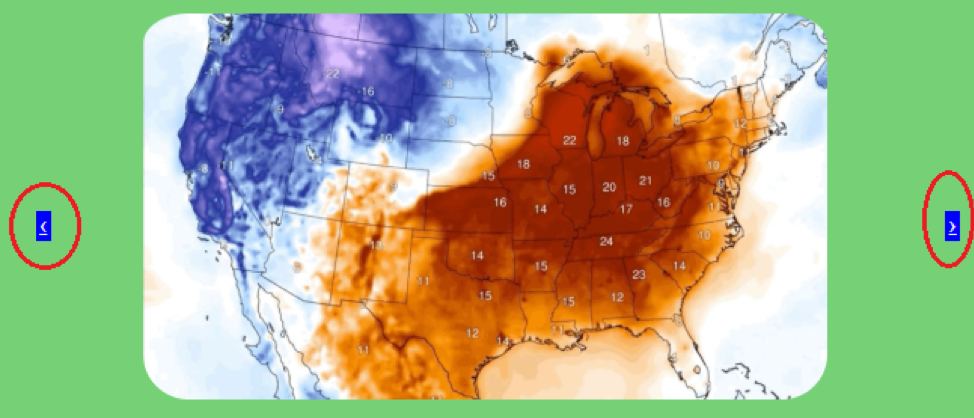
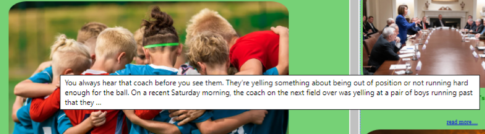
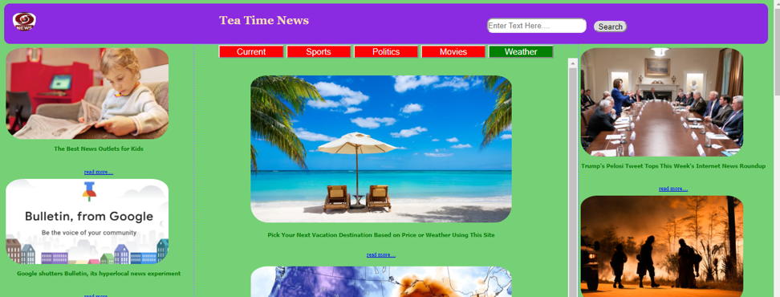
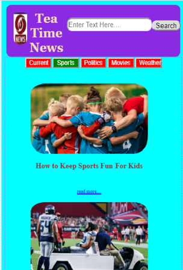
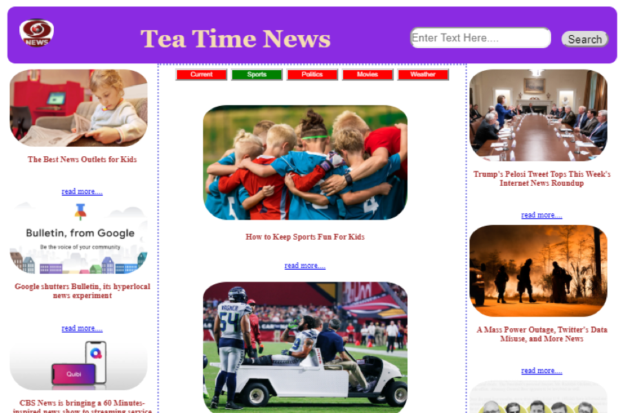

# Tea Time News

## Objectives

Tea Time News provides all kinds of NEWS update based upon different search criteria.

## Technologies

- HTML

* CSS

* Java script

* jQuery

* Ajax

## Application Programming Interface (API)

The Tea Time News webpage used the newsapi.org

## Functionality Covered

The user can accomplish different news update in following ways

1. Search:

The user can search any news by entering respective keywords in the search bar.

2. Option Buttons:

Users can navigate to the different news page by clicking on the following buttons

3. Carousel Button:

User can move to different news by clicking on previous and next carousel buttons

4. Read More Link:

User can know the news details by clicking on the “read more” link

5. Audio Play:

Audio will play by clicking on the News logo

6. Hover:

Displays the description of the respective news while mouse hovering

7. Responsiveness:

The news websites is responsive and can be viewed in any devices.

- Desktop View:
  

- Mobile View :
  

- IPAD View:
  

# My Web Page

http://teatime-news.surge.sh/
https://vigilant-engelbart-0e99cd.netlify.com/

# Created By

Mausumi Patra

# Supported By

- Leo

- Brian Carroll

- Joem Casusi
